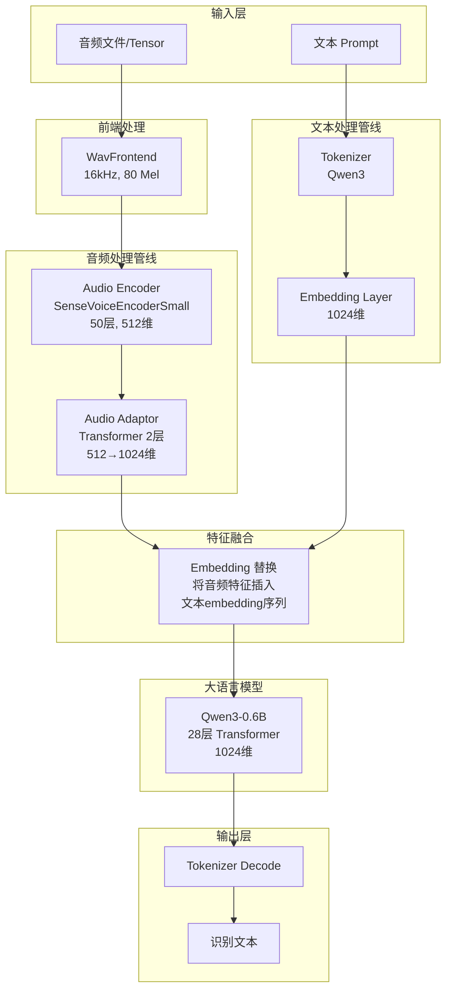
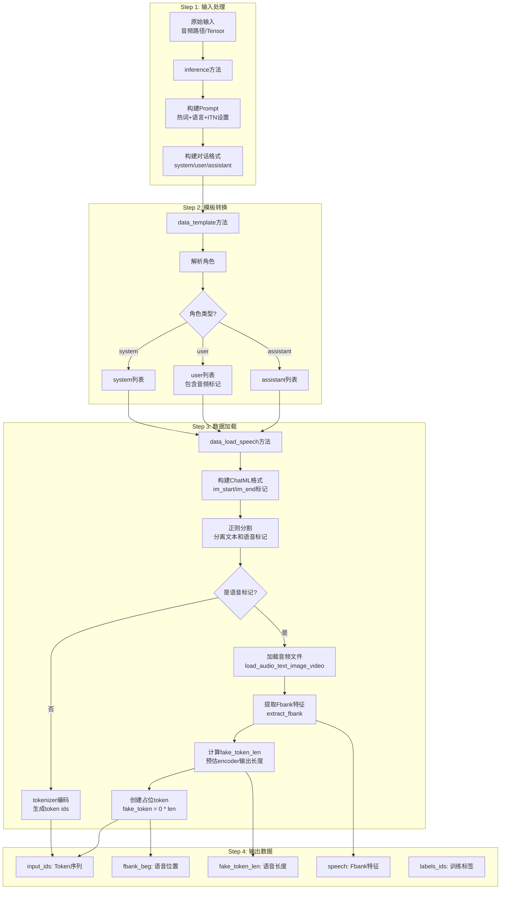
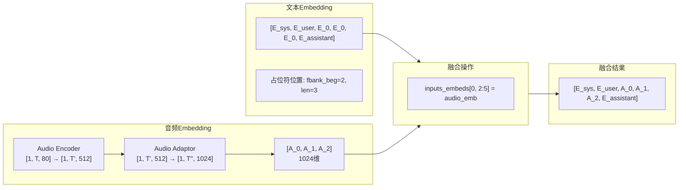
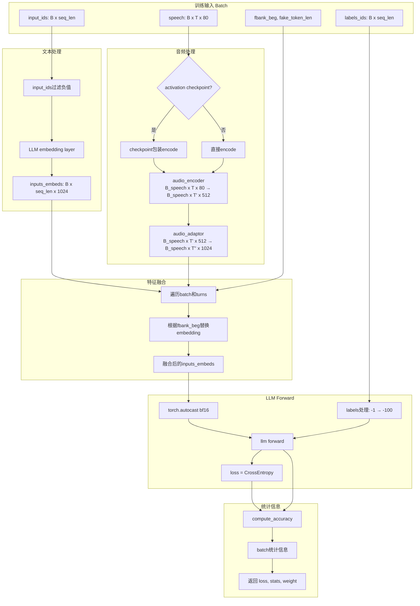
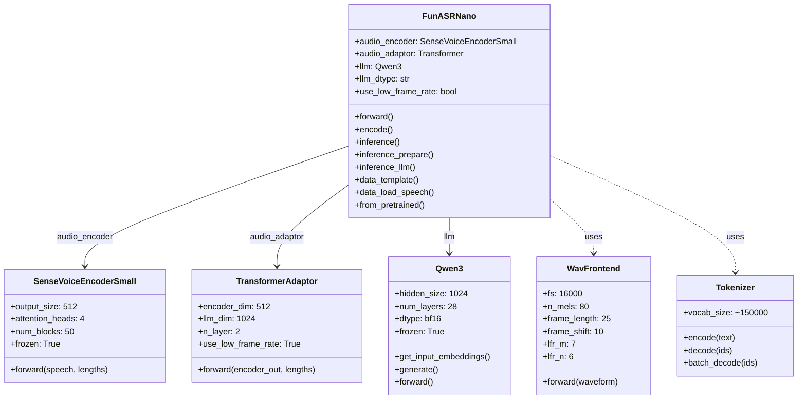
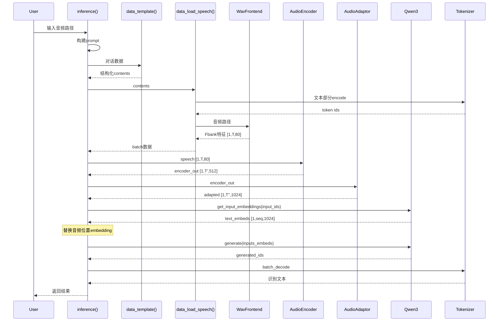
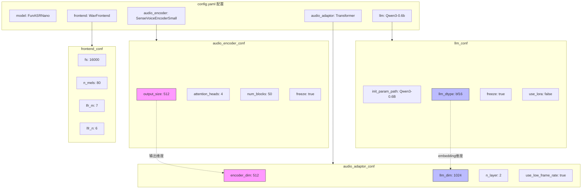
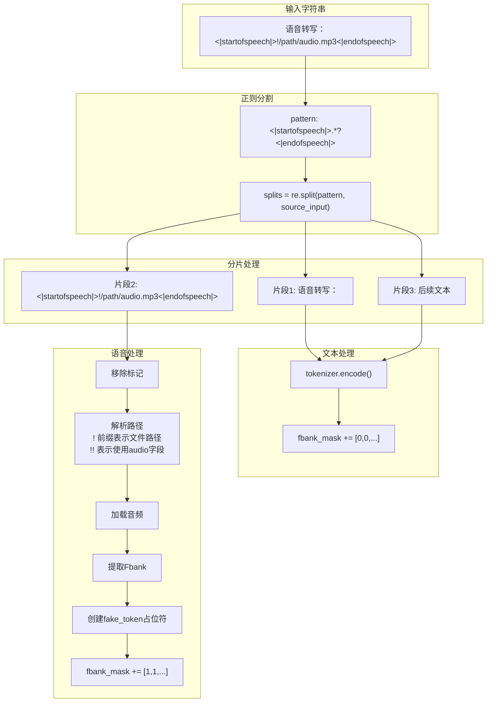
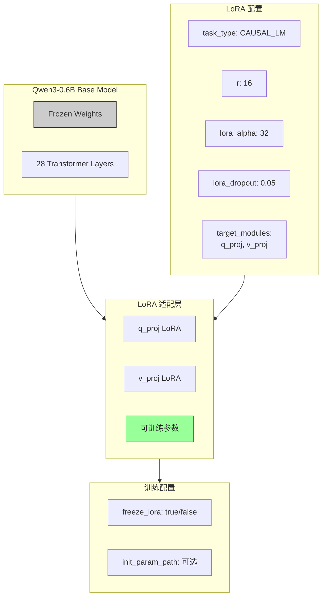

# Fun-ASR-Nano Mermaid 流程图

## 1. 整体架构图

## 2. 数据处理流程图

## 3. 推理流程详细图

```mermaid
flowchart TD
    subgraph Inference["推理流程"]
        I1[inference入口] --> I2[构建prompt和对话格式]
        I2 --> I3[inference_llm]
        I3 --> I4[inference_prepare]
        
        subgraph Prepare["数据准备"]
            P1[data_template] --> P2[data_load_speech]
            P2 --> P3[to_device移至GPU]
        end
        
        I4 --> P1
        P3 --> I5{有音频?}
        
        subgraph AudioEncode["音频编码"]
            AE1[self.encode<br/>Audio Encoder] --> AE2[self.audio_adaptor<br/>维度对齐]
        end
        
        I5 -->|是| AE1
        AE2 --> I6[获取text embedding<br/>llm.get_input_embeddings]
        I5 -->|否| I6
        
        I6 --> I7[替换音频位置embedding<br/>inputs_embeds替换]
        
        subgraph Generate["LLM生成"]
            G1[llm.generate<br/>自回归生成]
            G2[tokenizer.batch_decode<br/>解码为文本]
            G3[后处理<br/>清理特殊字符]
        end
        
        I7 --> G1 --> G2 --> G3
        G3 --> I8[返回结果]
    end
```

## 4. Embedding 融合流程图

## 5. 训练Forward流程图

## 6. 模型组件关系图

## 7. 数据流时序图

## 8. 配置依赖关系图

## 9. 特殊标记处理流程

## 10. LoRA 微调配置图

---

## 使用说明

这些 Mermaid 图可以在支持 Mermaid 的 Markdown 渲染器中查看，如：
- GitHub / GitLab
- VS Code (安装 Mermaid 插件)
- Typora
- Notion
- Obsidian

如果渲染器不支持 Mermaid，可以使用 [Mermaid Live Editor](https://mermaid.live/) 在线查看。
